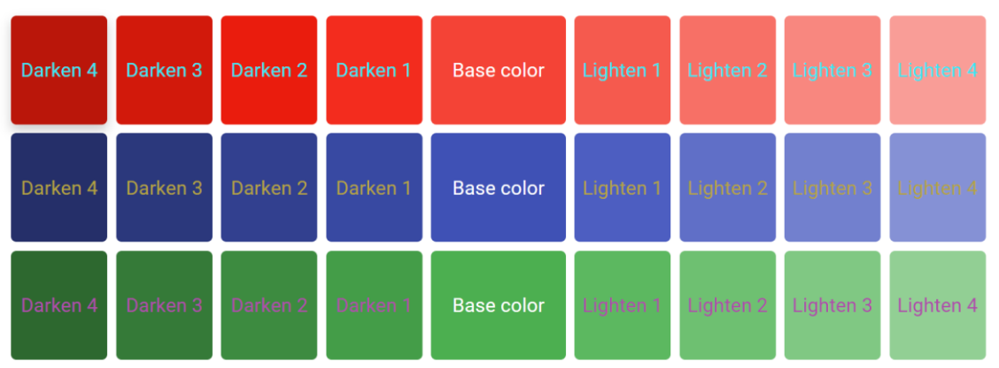
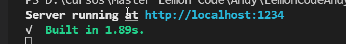

# Ejercicio 1: Crear una paleta de colores dinámica.

Usar el lenguaje Sass para crear distintos temas de paletas de colores.

La idea es partir de un color base, y a partir de ese color generar 4 colores más oscuros de manera gradual, y cuatro colores más claros de manera gradual.

Para comprobar que todo está funcionando como se espera utilizar el siguiente html:

```
<div class="container-1">
    <div class="box darken-4"><span class="color-box-text">Darken 4</span></div>
    <div class="box darken-3"><span class="color-box-text">Darken 3</span></div>
    <div class="box darken-2"><span class="color-box-text">Darken 2</span></div>
    <div class="box darken-1"><span class="color-box-text">Darken 1</span></div>
    <div class="box base-color"><span class="color-box-text">Base color</span></div>
    <div class="box lighten-1"><span class="color-box-text">Lighten 1</span></div>
    <div class="box lighten-2"><span class="color-box-text">Lighten 2</span></div>
    <div class="box lighten-3"><span class="color-box-text">Lighten 3</span></div>
    <div class="box lighten-4"><span class="color-box-text">Lighten 4</span></div>
</div>
```

NOTA: Para este ejercicio se puede utilizar cualquier estructura de Sass que se considere necesaria. El html para mostrar resultados deberá será modificado con clases.

Resultado esperado:


# How to run it:
1. We are using SASS with parcel. You will need to execute the following command:
    ```
    parcel .\Task-1\index.html
    ```
2. Once the command is executed you should be able to see the server url available:


## We tried to configure the darken and lighten methods dynamically but I didnt find a way to do it, as SASS is preprocessed I was forced to use a static variable for the color selection. The nice to have would be using an input color picker. 