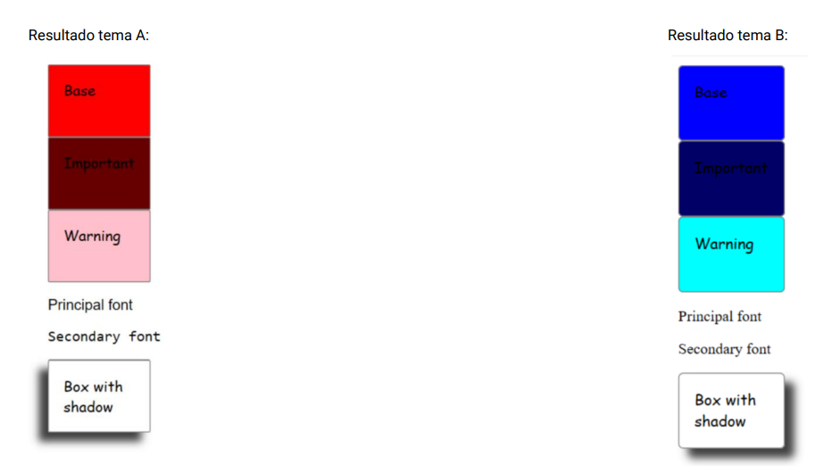

# Ejercicio 2: Crear una paleta de colores dinámica.

Los cambios en el tema afectan a las siguientes características:

- Color
- Fuente
- Border Radius
- Shadow Box

Para visualizar los cambios debería ser suficiente importar un tema u otro en el fichero de estilos principal.


Resultado esperado:


# How to run it:
1. We are using SASS with parcel. You will need to execute the following command:
    ```
    parcel .\Task-2\index.html
    ```
2. Once the command is executed you should be able to see the server url available:

