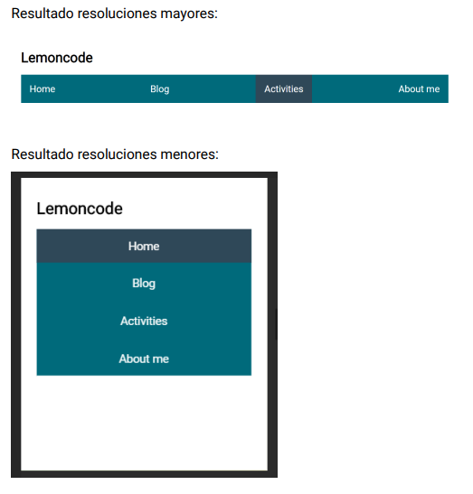
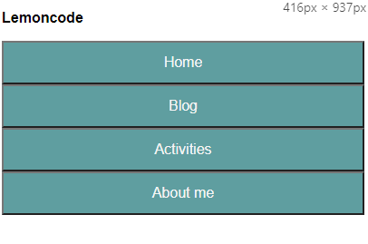
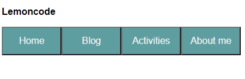

# Ejercicio 3: Crear la barra de navegación de la imagen usando Flexbox.

El html es abierto completamente, es decir crear las estructuras necesarias que se crean convenientes.

La barra de navegación responde a distintas resoluciones. Utilizar media queries para conseguir este resultado.

### Resultado esperado:

# How to run it:
1. Open index.html file
2. Final results
### Small screen:

### Big screen:

