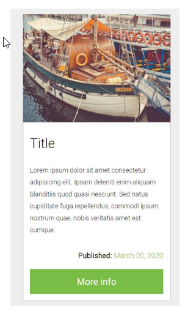
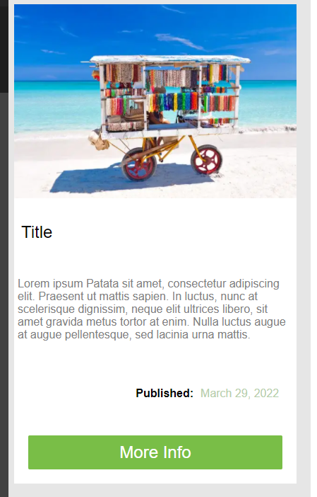

# Ejercicio 4: Crearemos un elemento de tipo card con Grid CSS.

Las alineaciones deberán hacerse con esta característica, pero el html es totalmente abierto.


### Resultado esperado:


# How to run it:
1. We are using SASS with parcel. You will need to execute the following command:
    ```
    parcel .\Task-4\index.html
    ```
2. Once the command is executed you should be able to see the server url available

### Result:


