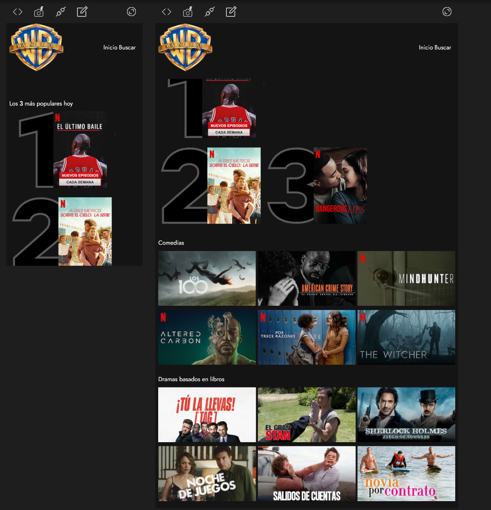
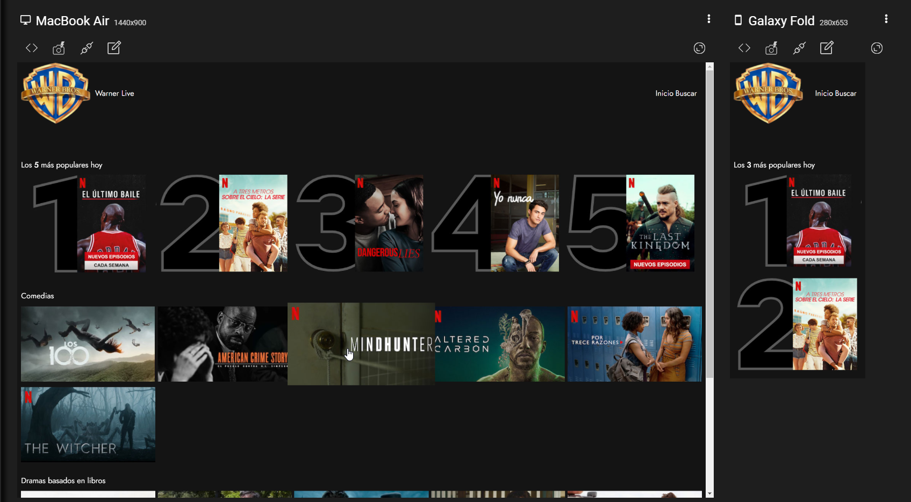
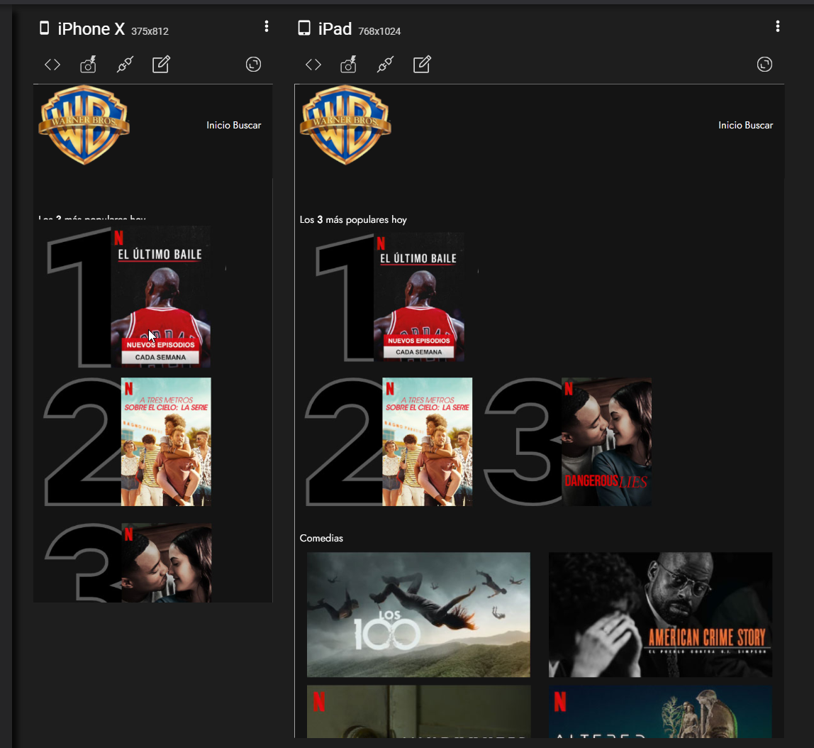

# Ejercicio 1: Reto del módulo.

### Una conocida casa cinematográfica quiere crear su propia plataforma on-line para servir sus producciones, a la que van a llamar WARNER LIVE.
### Nos han solicitado una prueba de maquetación de un primer diseño, del resultado de la prueba dependerá pasar a la siguiente fase de selección.


# How to run it:
1. We are using SASS with parcel. You will need to execute the following command:
    ```
    parcel .\src\index.html
    ```
2. Once the command is executed you should be able to see the server url available


4. Final results:





