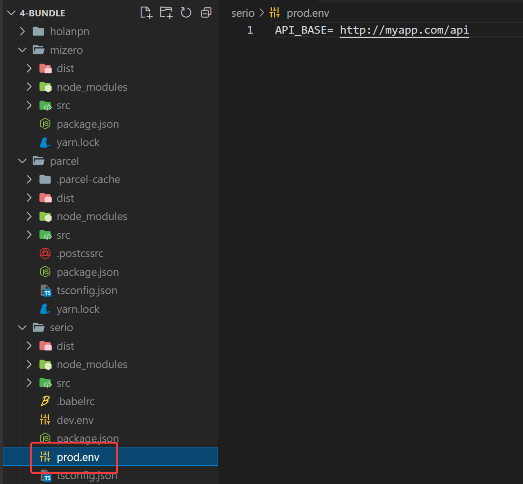

# Node notas

## Inicializa tu proyecto (crea fichero package.json). Si utilizas -y te evitas las preguntas iniciales

```js
npm init -y
```

```js
yarn init -y
```

### Instalar libreria

```js
npm install package --save
```

```js
yarn add package
```

### instala una librería como dependencia de desarrollo

```js
npm install package --save-dev
```

```js
yarn add package --dev
```

### Para instalar webpack y el CLI command line interface)

```js
yarn add webpack webpack-cli --dev
```

### Añadir babel para transpilar (CLI, core es el nucleo, preset-env son los settings para transpilar mas comun )

```js
yarn add @babel/cli @babel/core @babel/preset-env --dev
```

### Añadir loaders para unir babel a webpack

```js
yarn add babel-loader --dev
```

### Añadir loaders para utilizar sass

```js
yarn add sass-loader -–dev
```

Para usarlo

```js
   {
        test: /\.scss$/,
        exclude: /node_modules/,
        use: [
          "style-loader",
          {
            loader: "css-loader",
            options: {
              modules: {
                exportLocalsConvention: "camelCase",
                localIdentName: "[path][name]__[local]--[hash:base64:5]",
                localIdentContext: path.resolve(__dirname, "src"),
              },
            },
          },
          "sass-loader",
        ],

```

### Loaders para trabajar con imagenes (está incluido en webpack ahora ya está incluido )

```js
  {
    test: /\.(png|jpg|gif)$/,
    type: "asset/resource",
  },
```

### Html loader para renderizar bien el html si ejecutamos servidores locales, como lite-server o go-live(VsCode)

```js
yarn add html-loader –-dev
```

Para usarlo añadir dentro de module.rules

```js
{
  test: /\.html$/,
  loader: "html-loader",
},
```

### Crear servidor de transpilacion en memoria

```js
yarn add webpack-dev-server --dev
```

### Plugin para manejar html

```js
yarn add html-webpack-plugin -–dev
```

### lo importamos

```js
const HtmlWebpackPlugin = require("html-webpack-plugin");
```

### luego añadirlo al fichero webpack.config en la sección de plugins

```js
plugins: [
    new HtmlWebpackPlugin({
      filename: "index.html", // Fichero en dist
      template: "./index.html", // Fichero de entrada ./src
      scriptLoading: "blocking",
    }),
  ],
```

### Plugin para sacar los css como ficheros css

```js
yarn add mini-css-extract-plugin --dev
```

### para usarlo luego

```js
test: /\.scss$/,
        exclude: /node_modules/,
        use: [
          MiniCssExtractPlugin.loader, //(2)
          {
            loader: "css-loader", //(1)
            options: {
              modules: {
                 exportLocalsConvention: "camelCase",
                localIdentName: "[path][name]__[local]--[hash:base64:5]"
              },
            },
          },
          "sass-loader",
        ],

```

### (1)- es la configuración que se usa cuando queremos trabajar con múltiples ficheros css

Export locals convention es basicamente para convertir los ficheros que tienen – a camelCase
localIdenName: nombre de la clase que aparece luego

### Luego para utilizar los ficheros si queremos evitarnos colisión o si queremos tener mejor control de los estiles hacemos algo como esto (importarlos bajo el nombre de classes)

```js
import classes from "./averageComponentStyles.scss";
```

### y lo usas como

```js
<p className={classes.resultBackground}></p>
```

### Plugin para añadir variables de entorno .env

```js
yarn add dotenv-webpack –-dev
```

### se genera el fichero de variables de entorno



### para usarlo se añade a webpack

```
const dotEnv = require("dotenv-webpack");
```

### y luego lo usas en los plugins

```js
plugins: [
    new MiniCssExtractPlugin({
      filename: "[name].[contenthash].css",
    }),
    new dotEnv({
      path: "./prod.env",
    }),

```

### Para ejecutar el proyecto se puede usar el

```ts
yarn add lite-server -g (para instalarlo en global)
```

## Luego para ejecutarlo es solo poner en el terminal desde la carpeta dist (donde se genera el codigo que va a la web)

```p
lite-server
```

### Para ir hacienda control de errores, chequeo de tipos (para typescript) todo el tiempo se usa este paquete

```
yarn add npm-run-all --dev
```

### Para usarlo luego en el package.json se debe añadir

Run-p seria para ejecutar todo en npm-run all
El -l es para marcar con colores los logs

```js
"scripts": {
    "start": "run-p -l type-check:watch start:dev",
    "build:prod": "webpack --config webpack.prod.js",
    "build:dev": "webpack --mode development --config webpack.dev.js",
    "type-check": "tsc --noEmit",
    "type-check:watch": "yarn type-check --watch",
    "start:dev": "webpack serve --mode development --config webpack.dev.js",
    "start:prod": "webpack serve --config webpack.prod.js",
    "build:perf": "yarn type-check && webpack --config webpack.perf.js"
  },
```

## Extras de webpack

### Se debe crear un fichero webpack.config.js para otras configuraciones relacionadas con webpack. Importante los loaders se utilizan directamente pero los plugins se importan

### Para que la aplicación vaya siempre al contexto del src correcto se usa la línea path que es un método de node

```js
const path = require("path");
```

### y en el module.export declaro el contexto de trabajo

```js
module.exports = {
  context: path.resolve(__dirname, "./src"),
  resolve: {
```

### Si instalas react y typescript pero tienes también ficheros ts debes poner en el module.rules

### Test: /\.tsx?$/ (indicando que aceptas ts y tsx)

```js
module: {
    rules: [
      {
        test: /\.tsx?$/,
        exclude: /node_modules/,
        loader: "babel-loader",
```

### y luego en el module.exports.resolve le dices que extensiones buscara

```js
module.exports = {
  context: path.resolve(__dirname, "./src"),
  resolve: {
    extensions: [".js", ".ts", ".tsx"],
  },
```

### Si solo queremos ver los errores en los logs

```js
devServer: {
    port: 8081,
    devMiddleware: {
      stats: "errors-only",
    },
  },

```

### Webpack merge para combinar webpacks configs

```js
yarn add webpack-merge –-dev
```

### para usarlo

```js
const common = require("./webpack.common.js"); // de este vas a heredar
const { merge } = require("webpack-merge");
```

```js
module.exports = merge(common, { //aqui todo lo que quieras poner nuevo
  module: {
    rules: [
```

### En webpack para depurar código en el navegador se puede usar el eval-source-map (solo para testing)

```js
 plugins: [
    new MiniCssExtractPlugin({
      filename: "[name].[contenthash].css",
    }),
    new dotEnv({
      path: "./prod.env",
    }),
  ],
  devtool: "eval-source-map", //para en prod poder mirar codigo en el source webpack
```

### Para hacer análisis se puede usar el webpack analyzer

```js
yarn add webpack-bundle-analyzer –-dev
```

### para usarlo se genera un fichero webpack.perf.js (el perf es inventado) con una configuración parecida a esta (en este caso se quiere hacer el análisis en en el webpack de producción)

```js
const { merge } = require("webpack-merge");
const prod = require("./webpack.prod.js");
const { BundleAnalyzerPlugin } = require("webpack-bundle-analyzer");

module.exports = merge(prod, {
  plugins: [new BundleAnalyzerPlugin()],
});
```

### en el package.json se añadiría una script para ejecutarlo
```js
 "build:perf": "yarn type-check && webpack --config webpack.perf.js"
```

## Extras de babel

### También generamos un .babelrc, este fichero igualmente esta relacionado con las configuraciones de babel. Babel es como el transpilador, y debe conocer los settings de lo que se quiere interpretar, en este caso preset-env (los presets standars de babel), preset-react (para que interprete que el código es de react) y lo mismo con preset-typescript

```js
{
  "presets": ["@babel/preset-env", "@babel/preset-react", "@babel/preset-typescript"]
}

```
