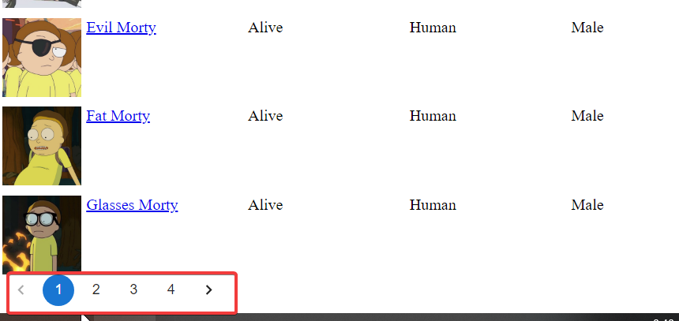

# 01 React laboratory 1

## Summary

### Filter by company name

The aim of this exercise is get Github organization list by companies. 

## Acceptances Criteria
- Use same example structure but with Rick and Morty api to display tv-show character
- Instead of having a button to trigger the filter, use debounce
- Filter by character
- Add pagination
- Display the character details selected

### Result:

º
## How to run the app
- Install dependencies (yarn/npm i)
- run the project (yarn start / npm run start)