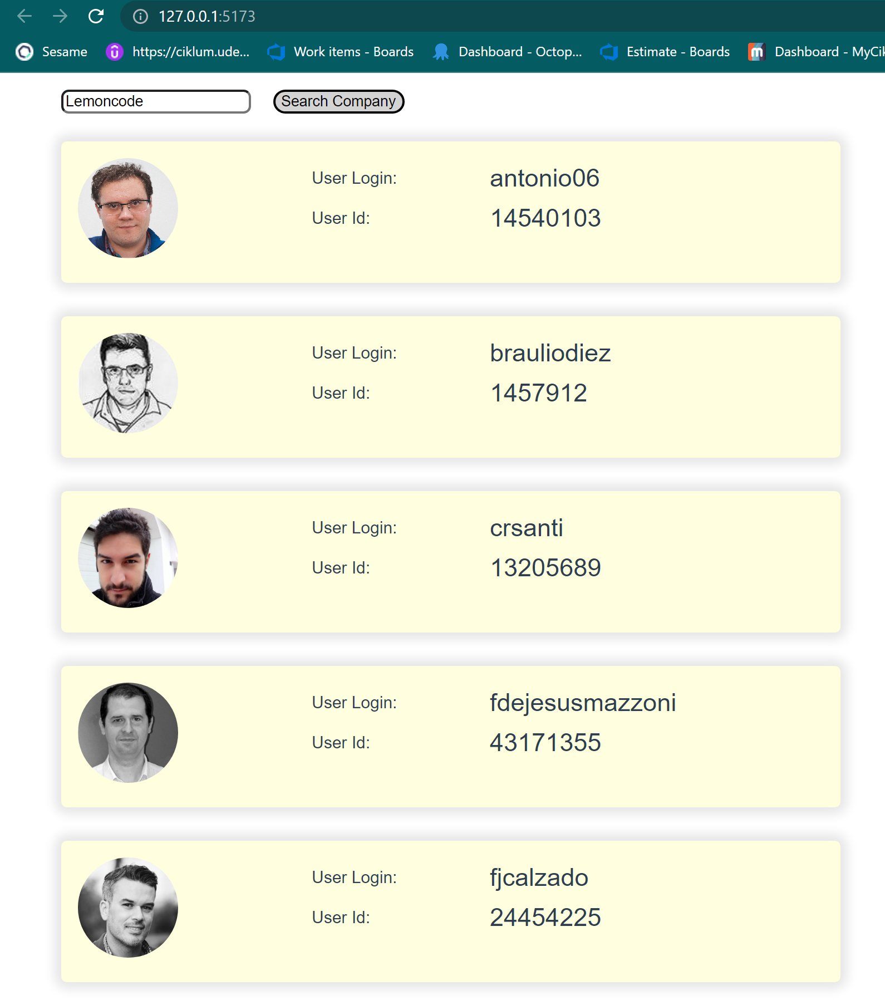
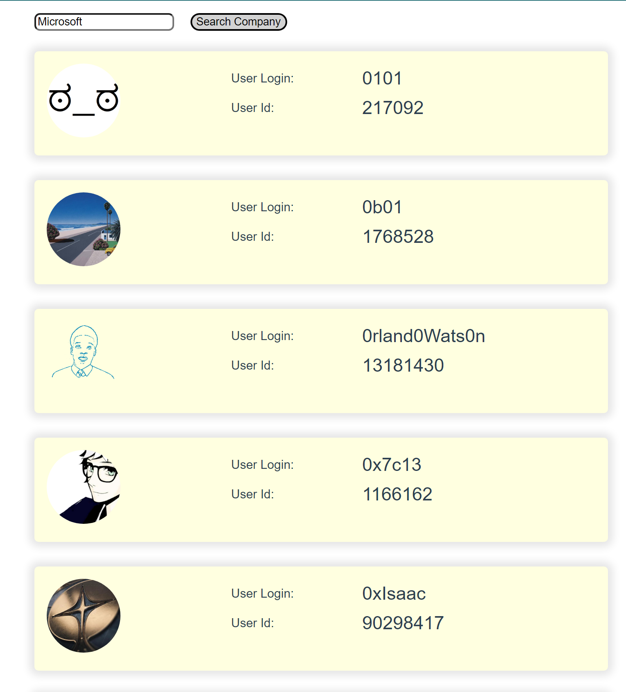
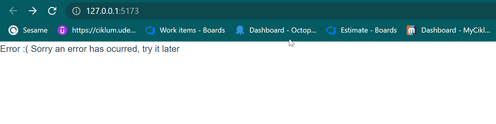

# 01 VUE laboratory 1

## Summary

### Filter by company name

The aim of this exercise is get Github organization list by companies. 

## Acceptance Criterias
- Create an app that displays a list of Lemoncode members on Github, using the Github API.
- Add a search field to search by organization name, this field defaults to "Lemoncode".
- And a button to search when pressed.
- Show at least one photo of each member and their name when you get a response.
- If no member or such organization is found, display an error message.
- The user can type another organization name, for example, "microsoft"; and when you press the search button, it shows you the members of that organization.
- By clicking on one of the members, navigate to a detail view of that member.
- In the detail view, show the member's photo, her name, email, bio, and organization name.
- When returning to the list view, the list that was there should continue to be displayed, without having to perform the search again.

## Result:
### List view

### Details view

### Other Company  view

### Error view

## How to run the app
- Install dependencies (yarn/npm i)
- run the project (yarn dev / npm run dev)