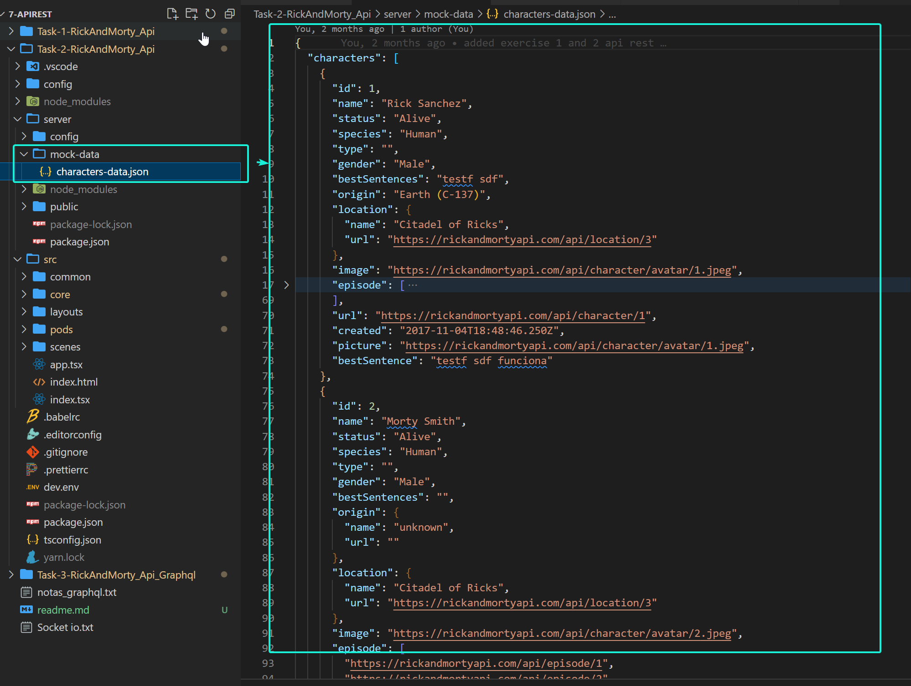
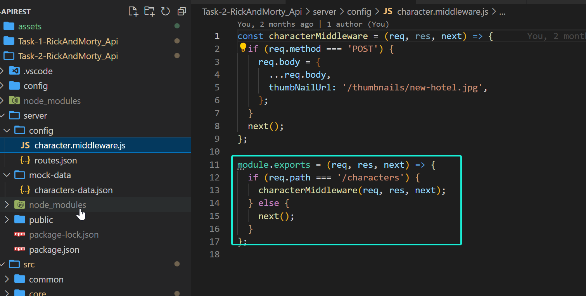
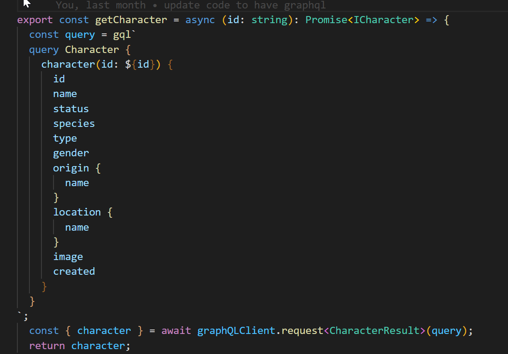

# REST API lab

- For this lab we use a free API to display Rick & Morty tv show details.

# Task 1: Use Axios or Fetch
- It has been created a project to get the characters from the api using Axios. 

# Task 2: Use a local server with json-server
- To create the mock data we use a response of the API call

- With the middleware we can indicates what to return when calling the endpoint


# Task 3: Implement task 1 with GraphQl
- We have implemented a client call with graphql 
Ex: 


# How to run the tasks
- Open the src folder. 
- Execute ```npm i```
- Execute ```npm run start```
